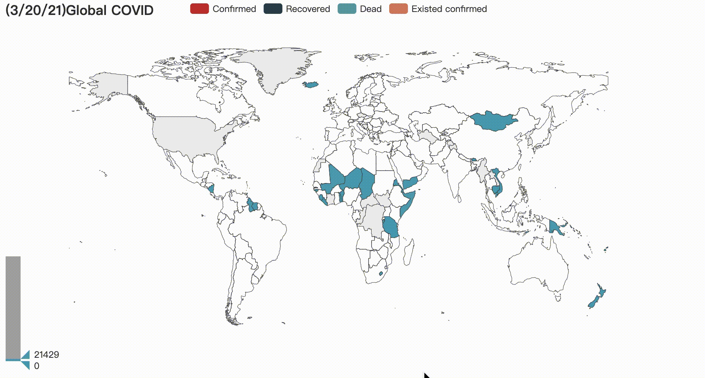

# Big Data COVID-19 Analysis

- Data source 
All the data is from Johns Hopkins Universitys github repository [COVID-19](https://github.com/CSSEGISandData/COVID-19/tree/master/csse_covid_19_data/csse_covid_19_time_series) 

## Technologies used 
- pandas: cleaning, analysing 
- pyecharts

## Visulization

